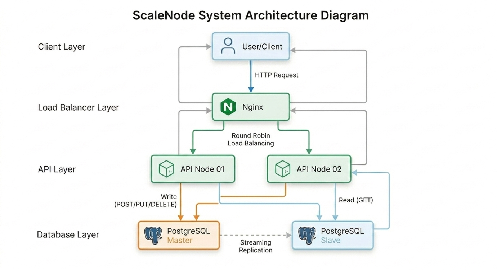

<div align="center">
  <h1>ScaleNode</h1>
  <medium>
    <strong>Author:</strong> Nguyễn Thành Tiến
  </medium> <br />
  <sub>April, 2026</sub>
</div>

---

## 1. Project Overall

**ScaleNode** là một hệ thống backend được thiết kế với khả năng **mở rộng cao (Scalable)** và đảm bảo tính **sẵn sàng (High Availability)**. Dự án tập trung vào việc thực hành và triển khai các kỹ thuật hạ tầng tiên tiến bao gồm:

- **Load Balancing**: Điều phối lưu lượng truy cập qua nhiều thực thể ứng dụng.
- **Read/Write Splitting**: Tối ưu hóa hiệu suất bằng cách phân tách luồng dữ liệu Đọc/Ghi.
- **Database Replication**: Đảm bảo an toàn và đồng bộ dữ liệu giữa các Node Master và Slave.

---

## 2. System Architecture Diagram

Hệ thống được tổ chức theo mô hình phân tầng, kết nối chặt chẽ giữa các thành phần thông qua mạng nội bộ Docker.



---

## 3. Tech Stack

Dự án sử dụng bộ công nghệ tiêu chuẩn để đạt được mục tiêu **Advanced Implementation**:

- **Load Balancer**: **Nginx** (Cấu hình Round Robin & Health Check).
- **Application**: **Node.js (Express)** - Chạy song song nhiều Instances.
- **Database**: **PostgreSQL** (Cấu hình Master-Slave Streaming Replication).
- **Infrastructure**: **Docker & Docker Compose** (Quản lý hạ tầng dưới dạng mã nguồn).

---

## 4. Project Structure

Tổ chức thư mục khoa học, tách biệt giữa mã nguồn ứng dụng và cấu hình hạ tầng:

```text
ScaleNode/
├── server/
│   ├── src/                # Mã nguồn Express.js
│   │   ├── config/         # Cấu hình kết nối DB (Pool Master/Slave)
│   │   ├── controllers/    # Điều hướng yêu cầu, nhận input và trả về response
│   │   ├── services/       # Xử lý logic nghiệp vụ (Business Logic) chính và thực hiện truy vấn
│   │   ├── models/         # Định nghĩa **Schema**
│   │   ├── middlewares/    # Kiểm tra dữ liệu (Validation), xử lý lỗi (Error Handling)
│   │   ├── routes/         # Định nghĩa các tuyến đường API
│   │   └── app.js          # Khởi tạo Express và gắn kết các thành phần
│   ├── Dockerfile
│   ├── package.json
│   └── .env
├── nginx/
│   └── nginx.conf          # Cấu hình Load Balancer
├── docker-compose.yml      # File điều phối toàn bộ hệ thống
├── docs/                   # Tài liệu hướng dẫn và sơ đồ
└── README.md
```

---

## 5. Getting Started

Để triển khai dự án trên máy cục bộ, hãy thực hiện theo các bước hướng dẫn dưới đây:

**Bước 1: Clone đồ án**

```bash
git clone https://github.com/tiennt220805/ScaleNode.git
cd ScaleNode
```

**Bước 2: Khởi động hệ thống (Setup)**

Chạy script tự động để cài đặt **Dependencies** và kích hoạt **Docker Containers**:

```bash
./scripts/local/dev-deploy.sh
```

Sau khi chạy, hệ thống sẽ sẵn sàng tại địa chỉ: `http://localhost`

**Bước 3: Dọn dẹp hệ thống (Cleanup)**

Khi cần xóa bỏ toàn bộ Container, dữ liệu Database và thư mục node_modules:

```bash
./scripts/local/dev-destroy.sh
```

---

## 6. Learn More

- Để tìm hiểu chi tiết hơn về các bước thiết lập, cấu hình **Replication** hoặc cách thực hiện **Stress Test**, vui lòng tham khảo tài liệu hướng dẫn: [Development Guide](./docs/development_guide.md).
- Để tìm hiểu về các bước để test đồ án, vui lòng tham khảo tài liệu hướng dẫn: [Test Plan]().
